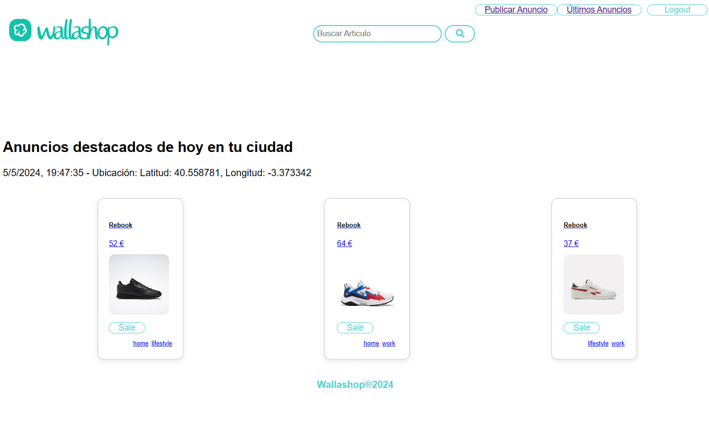
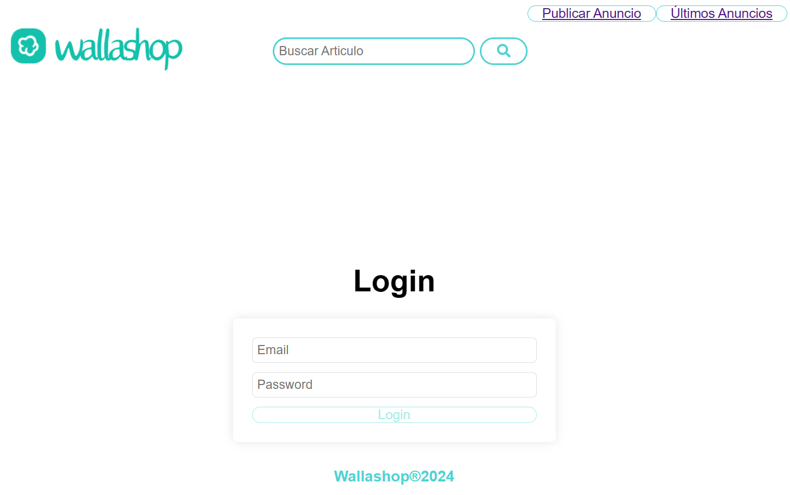
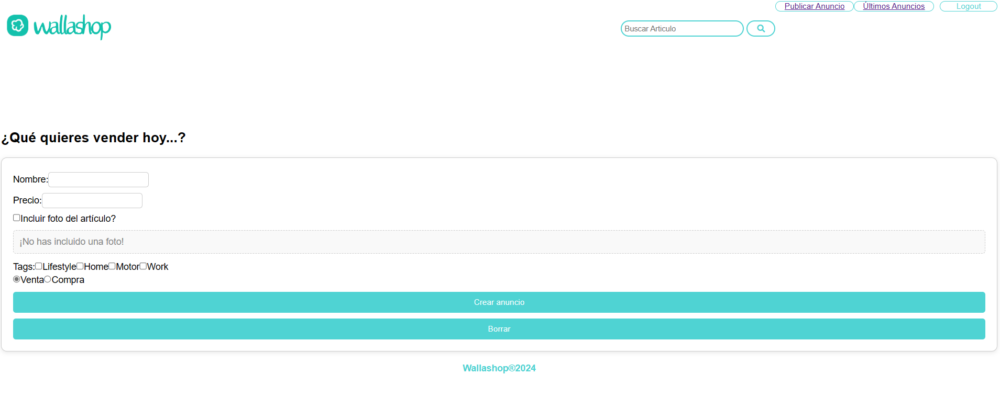
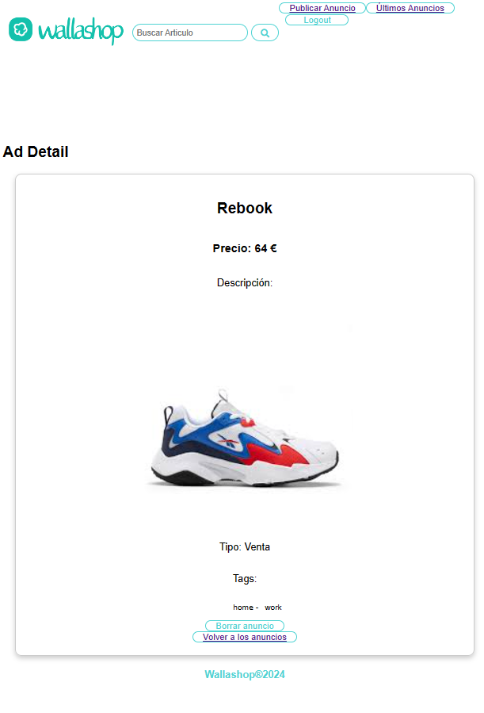

# Wallashop v1.0

Practica Fundamentos React consistente en un clone de Wallapop hecho con React - Desarrollo Web XVI

Proyecto configurado en **`Vite`** con React con JS + SWG 

Para el backend se ha utilizado la api del repositorio : `https://github.com/davidjj76/nodepop-api`

Curiosidades:
- para obtener la ubicacion del usuario, utilicé la API  de geolocalizacion del navegador 
- para indicar la antigüedad del anuncio, he utilizado la biblioteca date (no implementada aun)

## Technologies Used

The application is built with the following technologies:

- **React**: Used to build the application's user interface.
- **Vite**: Tool used for development and building the application with React with JS + SWG.
- **React Router**: Used to handle navigation in the application.
- **ESLint**: Used for static code analysis.
- **Nodepop API**: Backend of the application.

## Features

The application has the following features:

- **Viewing Ads**: Users can see a list of all ads available on the platform.
- **Ad Details**: Users can view the details of a specific ad, including the name, description, price, and photos of the item.
- **Creating Ads**: Authenticated users can create a new ad by providing the necessary details.
- **Deleting Ads**: Users can delete an ad if they are the creators of it.
- **Geolocation**: The application uses the browser's geolocation API to obtain the user's location.
- **Ad Age**: The age of the ad will be displayed to provide additional information about its relevance. (Not yet implemented)

## Images of the application

## How to Run the Application

Follow these steps to run the application:

1. Clone the repository.
2. Navigate to the project directory in your terminal.
3. Install the project dependencies with the command `npm install`.
4. Run the application with the command `npm run dev`.

La aplicación se ejecuta en `http://localhost:5173`.

## Application Status

_The application is still in development_

Currently, users can view, published ads, view details of each ad, and delete ads they have created. The functionality that detects if an ad has been created by the current user is still in development. 

Additionally, the application adjusts its interface depending on whether the user is authenticated or not, showing different navigation options.

The application detects the screens where the user is located, showing different information based on their location. For example, if the user is logged in, they will see the `Logout` button, but if they are not logged in, they will see the `Login` button.

Currently, the application distinguishes whether the user is logged in or not. If the user is not logged in and tries to perform an action reserved for registered users, they are redirected to the login screen. After logging in, they are redirected back to the screen they originally requested.
## Next Implementations

- Product Search: Implement a search function so users can find ads by keywords.
- Filters by Categories (Tags): Allow users to filter ads by categories or tags.
- Price Filter: Add the option to filter ads by price range.

## Contributions
We welcome contributions from the community! If you'd like to contribute to the project, please follow these steps:

* Open an issue to report bugs or suggest improvements.
* Fork the repository.
* Create a branch for your new feature: git checkout -b my-new-feature.
* Commit your changes: git commit -am 'Add a new feature'.
* Push your changes to the branch: git push origin my-new-feature.
* Submit a pull request.

## Contact

For any questions, suggestions, or feedback about the project, feel free to reach out. You can email us at syradominguez.dev@gmail.com

## Acknowledgements

Thanks to our teacher David (https://github.com/davidjj76) for his detailed explanations and his always willingness to help and answer our questions.