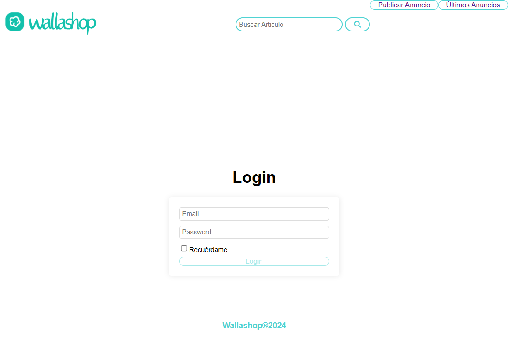
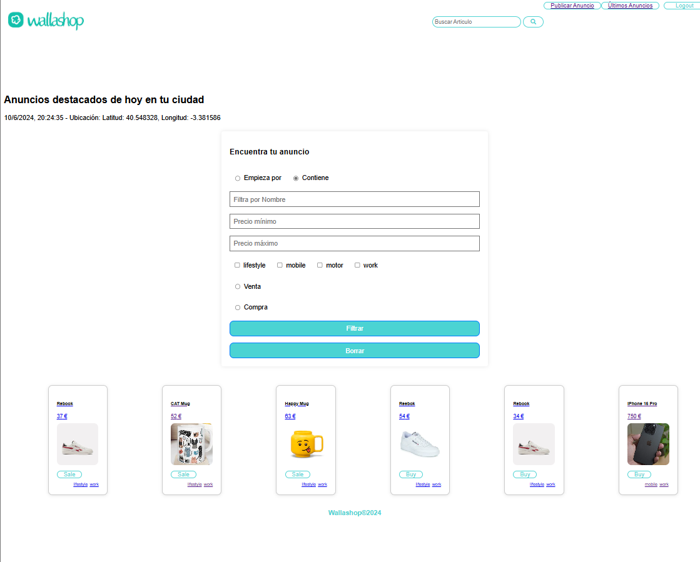
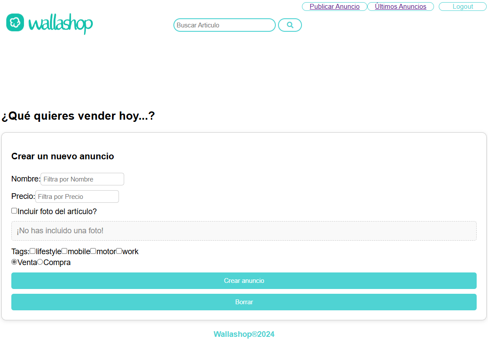
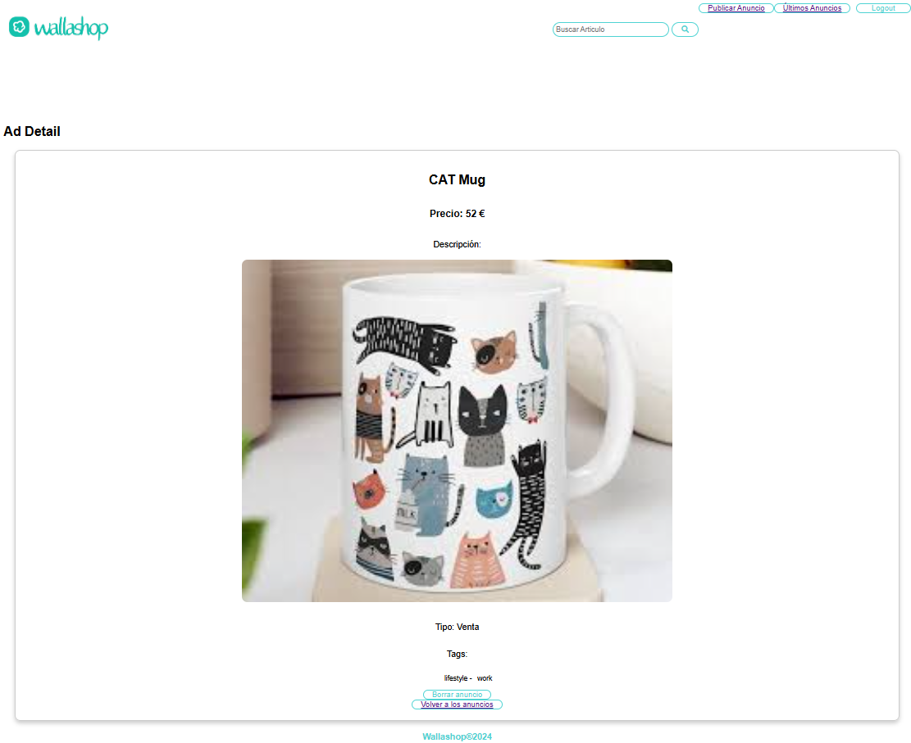

# Wallashop v2.0

Practica Fundamentos React consistente en un clone de Wallapop hecho con React - Desarrollo Web XVI

Proyecto configurado en **`Vite`** con React con JS + SWG 
## Project set up in Vite with React with JS + SWG

The backend has used the API from the repository: [Nodepop API](https://github.com/davidjj76/nodepop-api)

Curiosidades:
- para obtener la ubicacion del usuario, utilicé la API  de geolocalizacion del navegador 
- para indicar la antigüedad del anuncio, he utilizado la biblioteca date (no implementada aun)


## Technologies Used

- **React**: Used to build the application's user interface.
- **Vite**: Tool used for development and building the application with React with JS + SWG.
- **React Router**: Used to handle navigation in the application.
- **ESLint**: Used for static code analysis.
- **Nodepop API**: Backend of the application.

## Features

- **Viewing Ads**: Users can see a list of all ads available on the platform.
- **Ad Details**: Users can view the details of a specific ad, including the name, description, price, and photos of the item.
- **Creating Ads**: Authenticated users can create a new ad by providing the necessary details.
- **Deleting Ads**: Users can delete an ad if they are the creators of it.
- **Geolocation**: The application uses the browser's geolocation API to obtain the user's location.
- **Ad Age**: The age of the ad will be displayed to provide additional information about its relevance. (Not yet implemented).

## Recent Implementations (10.06.2024)

- Protected all `adverts` routes using the `RequireAuth` component.
- Removed unnecessary effect in `AuthContextProvider` to read from `localStorage`.
- The list of tags is obtained from the API in the `Form` component.
- Implemented at least two of the specified filters (name, buy/sell, price, tags).
- Filtering by name, with the option 'contains' and 'starts with', and filtering by price is done from the frontend.
- After creating an ad, the website redirects the user to the ad detail page.
- Modified `ads/service.js` to use Axios to handle `multipart/form-data` when creating an ad.
- Added a `ConfirmDialog` component for ad deletion confirmation and logout.
- Configured user session persistence when reloading the page.
- Implemented "Remember Me" functionality in the login.
- Added checkbox for "Remember Me" functionality in the login form.
- Email and "Remember Me" preferences are stored in `localStorage` if the checkbox is checked.
- Updated `AuthContext` to retain saved email even after logout.
- Ensured that the email field is pre-filled on the login page if "Remember Me" was previously selected.
- Added loading and error state handling in `AdDetailPage`.
- Improved user experience with loading state on the page.
- Ensured that the user's session remains active until the user logs out.
- Optimized redirection to the 404 not found page.

## Features Wallashop v2.0 (21/06/2024)

### Integrate Redux for authentication and advertisements management

- Added Redux store configuration
- Implemented login and logout actions with Redux
- Updated LoginPage to dispatch login action
- Updated AuthButton to dispatch logout action
- Ensured user and token are stored and cleared in Redux state
- Verified login and logout functionality with Redux DevTools
- Added actions for fetching, creating, and deleting advertisements
- Integrated thunk for asynchronous operations
- Implemented adsReducer to handle advertisement-related actions
- Created adActions file to define advertisement actions
- Updated AdsPage to fetch and display advertisements using Redux
- Added FilterForm component to filter advertisements
- Implemented advertisement detail page with delete functionality
- Verified advertisement CRUD operations with Redux DevTools

### Testing
- Add Jest configuration and setup files for unit testing + unit test for synchronous action `adActionsSync.test.js`
- Add unit test for async action in authActions `authActionsAsync.test.js`
- Add unit test for reducer `adReducer.test.js`
- Add unit tests for selectors `selectors.test.js`
- Add snapshot test for Form component `form.test.js`
- Add unit test for component with mocked store action `someComponent.test.js`

```shell
╰─ npm test

> wallashop@0.0.0 test
> jest

 PASS  __test__/adReducer.test.js
 PASS  __test__/authActionsAsync.test.js
 PASS  __test__/adActionsSync.test.js
 PASS  __test__/selectors.test.js
 PASS  __test__/form.test.js
 PASS  __test__/someComponent.test.js
  ● Console

    console.log
      Login button clicked

      at handleLogin (src/components/SomeComponent.jsx:11:13)

    console.log
      Logout button clicked

      at handleLogout (src/components/SomeComponent.jsx:17:13)


Test Suites: 6 passed, 6 total
Tests:       15 passed, 15 total
Snapshots:   1 passed, 1 total
Time:        1.939 s
Ran all test suites.

```


## Images of the application








## How to Run the Application

1. Clone the repository.
2. Navigate to the project directory in your terminal.
3. Install the project dependencies with the command `npm install`.
4. Run the application with the command `npm run dev`.

The application runs on `http://localhost:5173`.

## System Requirements

- Node.js (recommended version: 14.x or higher)

## Project Structure


```shell
Wallashop
├── public/
│   ├── index.html
│   ├── favicon.ico
│   └── assets/
│       ├── logo.png
│       └── ... (otros archivos de activos)
├── src/
│   ├── components/
│   │   ├── SomeComponent.jsx
│   │   ├── Form.jsx
│   │   ├── Header.jsx
│   │   ├── Footer.jsx
│   │   ├── AdList.jsx
│   │   └── ... (otros componentes)
│   ├── containers/
│   │   ├── HomeContainer.jsx
│   │   ├── AdContainer.jsx
│   │   └── ... (otros contenedores)
│   ├── pages/
│   │   ├── HomePage.jsx
│   │   ├── AdPage.jsx
│   │   ├── LoginPage.jsx
│   │   └── ... (otras páginas)
│   ├── hooks/
│   │   └── useAuth.js
│   ├── services/
│   │   └── api.js
│   ├── store/
│   │   ├── actions/
│   │   │   ├── authActions.js
│   │   │   ├── adActions.js
│   │   │   └── ... (otros archivos de acciones)
│   │   ├── reducers/
│   │   │   ├── authReducer.js
│   │   │   ├── adReducer.js
│   │   │   └── ... (otros archivos de reductores)
│   │   ├── selectors/
│   │   │   ├── authSelectors.js
│   │   │   ├── adSelectors.js
│   │   │   └── ... (otros selectores)
│   │   ├── store.js
│   │   └── ... (otros archivos relacionados con la store)
│   ├── styles/
│   │   ├── main.css
│   │   └── ... (otros archivos de estilo)
│   ├── App.jsx
│   ├── index.js
│   └── ... (otros archivos fuente)
├── __test__/
│   ├── authActionsAsync.test.js
│   ├── someComponent.test.js
│   ├── form.test.js
│   ├── selectors.test.js
│   ├── adReducer.test.js
│   ├── adActionsSync.test.js
│   └── ... (otros archivos de prueba)
├── .babelrc
├── .eslintrc.js
├── jest.config.cjs
├── jest.setup.js
├── package.json
├── README.md
├── vite.config.js
└── ... (otros archivos de configuración y documentación)

```

### Detailed Description

**public/**: Static files served directly.

- **index.html**: Main HTML of the application.
- **favicon.ico**: Application icon.
- **assets/**: Folder for static assets like images.
  - **logo.png**: Example of an image file.

**src/**: Main source code folder.

- **components/**: Reusable components of the application.
  - **SomeComponent.jsx**: Example of a component.
  - **Form.jsx**: Form component.
  - **Header.jsx**: Header component.
  - **Footer.jsx**: Footer component.
  - **AdList.jsx**: Component to list ads.
- **containers/**: Containers that connect components to the Redux store.
  - **HomeContainer.jsx**: Container for the main page.
  - **AdContainer.jsx**: Container for the ads page.
- **pages/**: Components for full pages.
  - **HomePage.jsx**: Main page.
  - **AdPage.jsx**: Ads page.
  - **LoginPage.jsx**: Login page.
- **hooks/**: Custom React hooks.
  - **useAuth.js**: Hook for authentication.
- **services/**: Services for API communication.
  - **api.js**: File for API calls.
- **store/**: Redux structure.
  - **actions/**: Redux actions.
    - **authActions.js**: Authentication actions.
    - **adActions.js**: Ad actions.
  - **reducers/**: Redux reducers.
    - **authReducer.js**: Authentication reducer.
    - **adReducer.js**: Ad reducer.
  - **selectors/**: Redux selectors.
    - **authSelectors.js**: Authentication selectors.
    - **adSelectors.js**: Ad selectors.
  - **store.js**: Redux store configuration.
- **styles/**: Style files.
  - **main.css**: Main styles.
- **App.jsx**: Main application component.
- **index.js**: Application entry point.

**__test__/**: Test files.

- **authActionsAsync.test.js**: Tests for asynchronous authentication actions.
- **someComponent.test.js**: Tests for the SomeComponent component.
- **form.test.js**: Tests for the Form component.
- **selectors.test.js**: Tests for selectors.
- **adReducer.test.js**: Tests for the ad reducer.
- **adActionsSync.test.js**: Tests for synchronous ad actions.

**Configurations and other files**: Configuration and documentation files.

- **.babelrc**: Babel configuration.
- **.eslintrc.js**: ESLint configuration.
- **jest.config.cjs**: Jest configuration.
- **jest.setup.js**: Jest setup files.
- **package.json**: Project dependencies and scripts.
- **README.md**: Project documentation.
- **vite.config.js**: Vite configuration.

## Application Status

The application is in development.

Currently, users can view published ads, view details of each ad, and delete ads they have created. The functionality that detects if an ad has been created by the current user is still in development.

Additionally, the application adjusts its interface depending on whether the user is authenticated or not, showing different navigation options.

The application detects the screens where the user is located, showing different information based on their location. For example, if the user is logged in, they will see the Logout button, but if they are not logged in, they will see the Login button.

The application distinguishes whether the user is logged in or not. If the user is not logged in and tries to perform an action reserved for registered users, they are redirected to the login screen. After logging in, they are redirected back to the screen they originally requested.

## Contributions
We welcome contributions from the community! If you'd like to contribute to the project, please follow these steps:

* Open an issue to report bugs or suggest improvements.
* Fork the repository.
* Create a branch for your new feature: git checkout -b my-new-feature.
* Commit your changes: git commit -am 'Add a new feature'.
* Push your changes to the branch: git push origin my-new-feature.
* Submit a pull request.

## Contact

For any questions, suggestions, or feedback about the project, feel free to reach out. You can email us at syradominguez.dev@gmail.com

## Acknowledgements

Thanks to our teacher David (https://github.com/davidjj76) for his detailed explanations and his always willingness to help and answer our questions.

